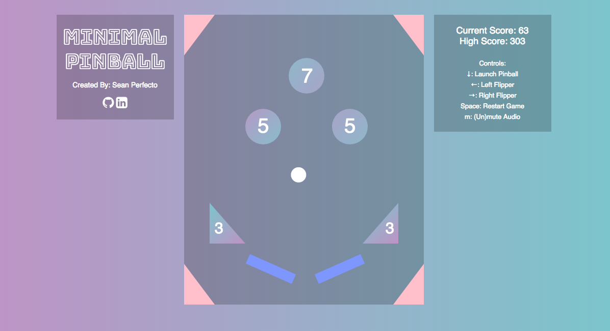

# Minimal Pinball

This pure Javascript and HTML game strips down a classic arcade game into a more visually appealing, and simple yet addicting web browser game.



## Instructions

The objective is straightforward as it gets: rack up the most points that you can with one life. Not your average classic pinball game, my game implements a faster pace and more unpredictability, leading to a more addicting gameplay. Try to get at least 1000 points. Play once, and be hooked.

Designed and implemented for anybody to use, this game is controlled solely by five different keyboard keys:

- Down Arrow: Launch Pinball
- Left Arrow: Left Flipper
- Right Arrow: Right Flipper
- Spacebar: Restart Game
- "M" Key: Mute/Unmute Audio

## Technology/Languages Used

The biggest challenge that I had to implement within making this project in a week was to construct this game without any Javascript libraries. Although looking back on it, there are some disadvantageous to this, I am glad I spent the time to learn more about plain Vanilla JavaScript and HTML Canvas.

Technologies I used:
- `Plain Vanilla JavaScript`
- `HTML5 Canvas`
- `CSS3`

## Technical Implementation

Perhaps by not using any library, the fun aspect of implementing these features was my revisit to several math and physic type functions and integrating them into code.

#### Collision Detection

Interaction of the pinball with the different objects was the main challenge with this game. Integrating physical properties like gravity and elasticity the game was fairly simple. The two parts that I had to figure out were how to detect collision with the pinball and the object and how to resolve the velocity vector of the pinball after collision.

With collision detection, the challenge was handling the different shapes that interacted with the pinball. For example, to detect collision with a circular bumper, I compared the distance between them and their radii.

```javascript
// ball.js

let distance = Math.sqrt(
  Math.pow(this.ballPosX - obj.ballPosX, 2) +
  Math.pow(this.ballPosY - obj.ballPosY, 2));
return distance < (this.radius + obj.radius);
```
But something different such as the flipper (a rectangle), implements different collision detection. For lines/rectangles, I compared the distance between the center of the object and the circle, and tested each edge case:

```javascript
// ball.js

// X and Y distance between the ball and the bump
let distX = Math.abs(this.ballPosX - (obj.mid.x));
let distY = Math.abs(this.ballPosY - (obj.mid.y));

// Distance too far
if (distX > (obj.halfwidth + this.radius)) { return false; }
if (distY > (obj.halfheight + this.radius)) { return false; }

// Distance definitely colliding
if (distX <= obj.halfwidth) { return true; }
if (distY <= obj.halfheight) { return true; }

// Checks corners using Pythagorean Theorem
let dx = distX - obj.halfwidth;
let dy = distY - obj.halfheight;
return ((dx*dx)+(dy*dy)<=(this.radius*this.radius));
```

#### Elastic Collision Outcome

The second challenge after detecting collisions is changing the ball's velocity after colliding with an object.

## Future Features
