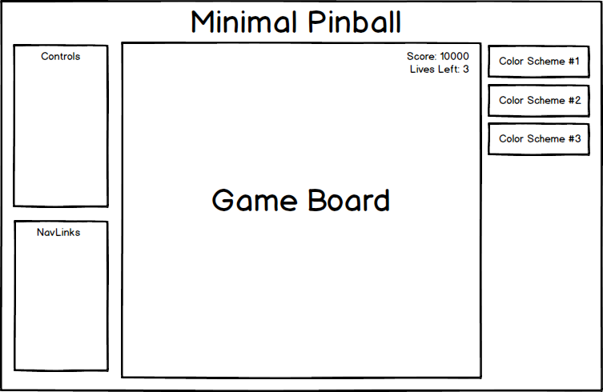

# Minimal Pinball (Proposal)

## Background

Everybody knows the classic arcade game of **Pinball**. It usually consists of one player and three chances (three balls). The object of the game is to rack up the most points by hitting several targets on a pinball board while trying to keep the ball alive.

The joy of pinball is the many different themes that people apply to them. In my Javascript version of pinball, I want this version to be super visually appealing and simple to the eye of the player. Sometimes, pinball can get very busy and messy, and I want to strip it down to make it a minimal yet elegant looking game. I will do execute these objectives as detailed in the **Functionality and MVP's** and **Bonus Features**.

## Functionality and MVP's

With my version of pinball, users will be able to:

- [ ] Start, pause, and reset the game
- [ ] Control the flippers with different type of keys

In addition to this, the project will also include:

- [ ] An about modal showing the instructions and rules
- [ ] A production README

## Wireframes

This app will be single screen which will include all the necessary information. In the middle will include the main part, the game board, which I will probably make it a little more squarish than most pinball boards to utilize the screen size (the board will include the point total as well as number of lives left). On top will be the title, and on the right side there will be options for the user to toggle between different color schemes. And finally on the left, there will be a controls legend key, as well as a navlink section with my Github/Linked information and an About modal.

## Architecture and Technologies

Minimal Pinball will be constructed using these technologies:

- Vanilla Javascript and `jquery` for structure and game logic
- `HTML Canvas` and `Easel.js` for DOM manipulation and rendering
- Webpack to bundle up different files

With the webpack entry file, there will be these following files:

- `board.js`: This is where the different pieces and flippers will be. Might possibly have to have a flipper.js file to handle the logic there.
- `ball.js`: The information about the ball itself, including the size and speeds will be here.
- `game.js`: The game logic and counting points will be here. Information about how the player can rack up points and get a high score.

## Implementation Timeline

**DAY 1**

Set up all the node modules, with webpack and easel. Create a backbone for the webpack and package json files, as well as learn the basics of easel. Goals:

- Learn Easel
- Set up project with webpack and skeletons

**DAY 2**

Try to use what I learned yesterday to render some pieces for the ball.js and board.js files. Learn more about how to control ball velocity and direction. Goals:

- Render objects for the board and ball files
- Think about how to handle game logic

**DAY 3**

Here, I will try to create all the game rules and different points for pinball. Add different sound effects and effects for the game. Goals:

- Implement game logic, as well as add all the different effects

**DAY 4**

Here I will master and clean the code. If I am behind, I can use this day to catch up. Goals:

- Make the game as beautiful and clean as possible

## Bonus Features

Some bonus features that I would like to explore later, would be:

- [ ] Make the game a little more accessible-friendly
- [ ] Possibly add different difficulties
